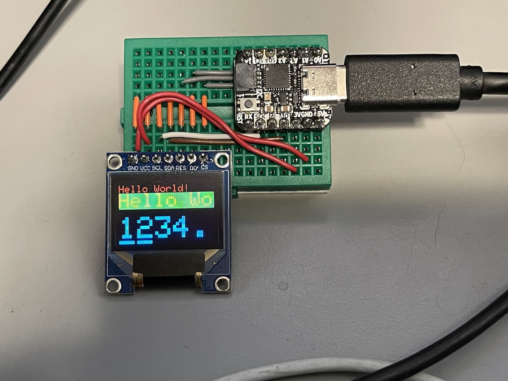

# spi-display-tester

This is some simple Arduino code for that demonstrates interfacing with various SPI-based OLED and TFT displays.

I've amassed a small collection of various SPI displays for various projects.

For a long time, I've had a number of different sample sketches specific to each display controller that I would crib from when I wanted to use one of the displays. This is a consolidation of those projects into one. 

This pulls from the sample code included with several of the Adafruit_GFX driver libraries, and attempts to reconcile some of the tests that are different between color/grayscale/monochrome displays.

Having put it together for my own use, it seemed like it could be useful to someone else out there, so I decided to push it to github.

The pin assignments are set up based on a couple of different breadboards I've put together. The simplest one is just an Adafruit QT PY with wires that allow me to plug most of these displays in at the corner of the breadboard. Fortunately, most of these displays have pinouts that are close enough that they can just plug into the same spot.

You may notice that some of the library references in the platformio.ini point at my own repositories on github. I've either added or improved support for a number of these displays over time. Feel free to reference or fork any of those repositories if you find them useful.

## Usage

This is set up to build with PlatformIO on VS Code. If you're using different tools, you're on your own.

Edit platformio.ini to match the board you want to build to. I recommend adding another section using one of the existing ones (`env:adafruit_qt_py_m0` or `env:tinypico`) as a guide.

In main.cpp, adjust the definitions of `CS_PIN/DC_PIN/RST_PIN` to match how you've got the display wired up (it assumes you're using the default hardware SPI interface).

Enable one of the sections in the `#if ... #elif ... #else` chain that matches the display you're using.

Build and run. Best case scenario, you should see some things happen on the display.

There's also some serial logging that prints out timings for the various tests. These can be helpful for before/after metrics if you're making changes to any of the display support libraries or comparing the performance of different displays or microcontrollers, but aren't especially useful in isolation.

Share and enjoy.